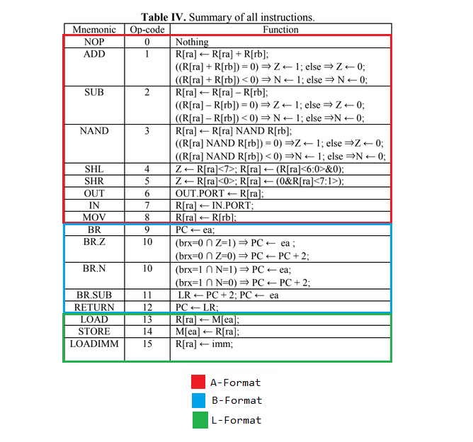
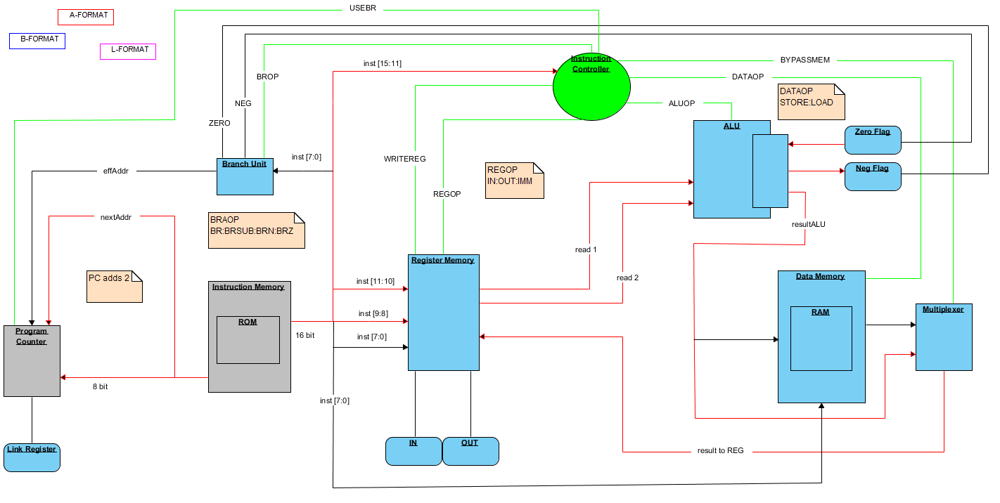
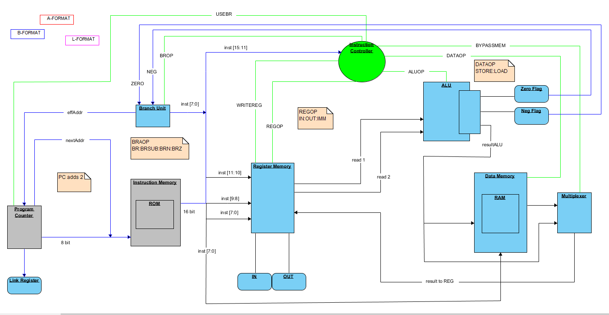
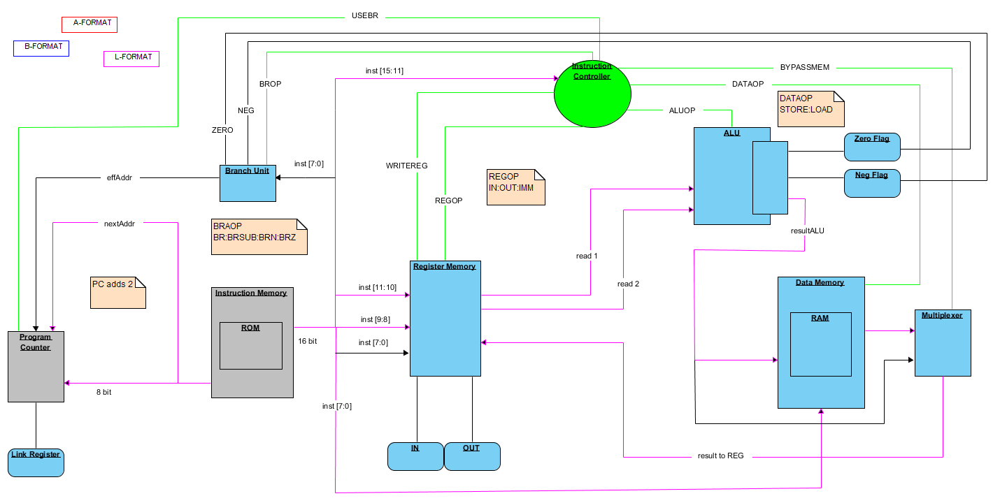

# 16bitSingleCycleProcessor

Compile using Quartus Prime Lite 16.1. Mimicks MIPS architecture, with 16-bit signals. Performs simple operations for a basic processor.

## Purpose

To program a simple processor that mimicked the 32-Bit architecture according to MIPS. The resultant processor took 16-bit signals instead of 32-bit signals (arbitrary constraint).

## Repo Contents

* AFORMAT, BFORMAT, LFORMAT PNGs
  * Images describing logical paths followed by the processor to acheive operation

* InstructionSet PNG
  * Image describing instruction formats that the processor must handle

* Output PNG
  * Testing image taken using Quartus, describes signal at output terminals

* subroutine TXT
  * Text file describing the subroutine and code signals given to the processor during operational testing

* ABL Processor with Clock Divider
  * Contains all verilog files for processor, with clock divider included
  * Clock divider used to limit the cycles of the processor, as the processor was tested physically on a board with LEDs

* ABL Processor without Clock Divider
  * Contains all verilog files for processor

## Description

In accordance with regular processors, this 16-Bit single-cycle processor take input stored in instruction memory, which contains multiple 16-bit codes defining a subroutine (shown in the subroutine.txt file).

The operations performed are described in the following image.

Instructions are algebraic operations, bitwise operations, and memory operations. Branch operations are also described and performed by the processor, and include conditional branches.

The processor itself is divided into several parts:

* Instruction Memory
  * Contains all instructions as 16-bit codes for the test subroutine
* Register Memory
  * Contains registers, used for operations in the ALU and Data
  * Also connect to input and output terminals and loads based on current operation
* ALU
  * Performs bitwise and algebraic operations given contents from registers
  * Flips flags based on operations for conditional ops
* Data Memory
  * Contains a RAM
  * Stores and loads register contents
  * Connects to multiplexer depending on instruction
* Program Counter
  * Specifies next instruction to be carried out
* Link Register
  * Specifies branch instruction address (where to go, and where branch started)
* Branch Unit
  * Handles branch operations, which affect next effective instruction address
* Instruction Controller
  * Given operation codes from instruction memory, tells all other parts what operations must take place

Basic operation is as follows: 

1. Program Counter specifies instruction address
2. Instruction Memory loads address and distributes to Intruction Controller
3. Instruction Controller sends signals to all parts specifying what to do
4. Rest of the instruction code fed directly to Register Memory to fill registers or to Branch Unit to perform branch
5. Register contents fed to ALU or Data Memory for certain operations
6. Zero and Negative flags flipped on certain ALU operations
7. Program Counter specifies next effective instruction address

### AFORMAT

Algebraic operations and bitwise operations. These instructions are performed on register contents depending on instruction codes.

### BFORMAT

Branch operations. Must obey conditional flags set by AFORMAT instructions.

### LFORMAT

Memory operations. These instructions load and store data from registers defined in Register Memory.

